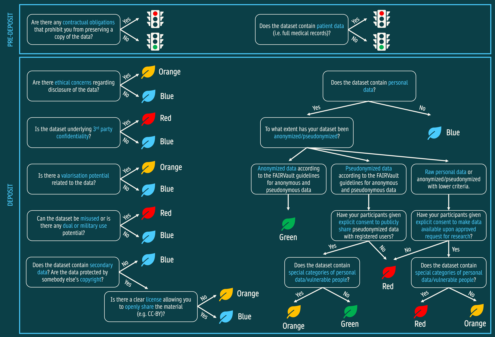

# Decision tree 
By answering the questions of the decision tree, you and the data curators will be able to identify the appropriate Data Tag for your deposit in the FAIRVault.  
The most stringent Data Tag that applies to your data will be applied (least to most stringent: Blue < Green < Orange < Red). In case of an Orange or Red Data Tag, indicate in FAIRVault **all** legitimate opt-out reasons that apply: 
- Privacy
- Intellectual property rights
- Ethical aspects
- Aspects of dual use
- Other

## Pre-deposit
Before starting your upload in FAIRVault, it is important to think about the following: 
   - Are there any contractual obligations that prohibit you from preserving a copy of the data?​​ 
   - Does the dataset contain patient data (i.e. full medical records)?​

In case the answer to one of these questions is 'YES', you are not allowed to deposit the data in the FAIRVault.

## Deposit
a) Fill out the the metadata fields relating to the FAIRVault decision tree.   
b) The questions are also available as a [Decision Tree questionnaire](https://ugent.qualtrics.com/jfe/form/SV_0od3zuglm2D01P8)

## Extra explanation to the questions
- Are there ethical concerns regarding disclosure of the data?
  - You should answer 'yes' if disclosing the data could raise ethical concerns — for example, if it risks harming individuals or groups, involves sensitive personal or cultural information, includes data from vulnerable populations, lacks proper informed consent for sharing, or could be misused in ways that cause discrimination, stigmatization, or other negative consequences.
  - Ethical concerns also apply if disclosure would violate legal, institutional, or community agreements.
  - *If 'yes', select 'Ethical Aspects' under legitimate opt-out reason in FAIRVault.*
- Is the dataset subject to third party confidentiality?
  - You should answer 'yes' if the dataset contains information that is subject to confidentiality agreements with third parties — for example, data provided by external organizations, companies, or collaborators under a contract containing a confidentiality clause or a non-disclosure agreement (NDA).
- Is there a valorisation potential related to the data?  
  -  You should answer 'yes' if the data has potential commercial value — for example, if it could be used for developing products, services, patents, or innovations, or if it holds relevance for industry partners, startups, or other external stakeholders.
  -  *If 'yes', select 'Intellectual property rights' under legitimate opt-out reason in FAIRVault.*
- Can the dataset be misused (knowledge security) or is there any dual or military use potential?  
  - You should answer 'yes' if the dataset could be misused in a way that causes harm or if it has potential for dual use — meaning it could serve both civilian and military purposes — or if it could be applied in ways that conflict with ethical, legal, or security standards.
  - *If 'yes', select 'Aspects of dual use' under legitimate opt-out reason in FAIRVault.*
- Does the dataset contain secondary data? Are the data protected by third party copyright?
  - You should answer 'yes' if the dataset includes secondary data — meaning data originally collected or generated by someone else — or if it contains material protected by third-party copyright.
  - *If yes, is there a clear license allowing you to openly share the material (e.g. CC-BY)?​*
- Does the dataset contain personal data?​ 
  - *If yes, to what extent has your dataset been anonymized/pseudonymized?​*
  - **Note:** The FAIRVault definitions of anonymous and pseudonymous data are still in development. For now, you can consult the [UGent Research Tip on personal data](https://onderzoektips.ugent.be/en/tips/00001781/#Pseudonymisedpersonaldata) for guidance.
    - If pseudonymized, have your participants given explicit consent to publicly share pseudonymized data?​
      - If yes, does the dataset contain special categories of personal data/vulnerable people?
        - Special categories of personal data = Race, political views, religious or philosophical beliefs, trade union membership, genetic data, biometric data, health data, data on a person’s sexual behavior or sexual orientation and data relating to criminal convictions or offences.
    - *If raw data, have your participants given explicit consent to make data available upon approved request for research?*
      - *If yes, does the dataset contain special categories of personal data/vulnerable people?*
        - Special categories of personal data = Race, political views, religious or philosophical beliefs, trade union membership, genetic data, biometric data, health data, data on a person’s sexual behavior or sexual orientation and data relating to criminal convictions or offences. 
