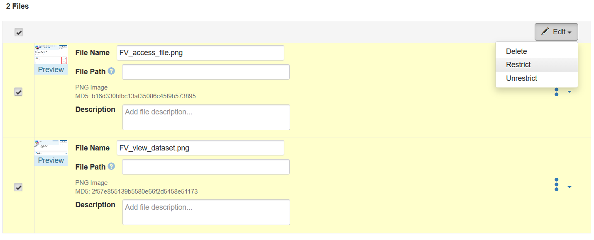

# Green (Registered) sensitivity level: non-confidential and low-sensitivity data with some access control

If a dataset can be shared with minor access restrictions, the dataset can be labeled with a green (Registered) sensitivity level.
**Anyone with a FAIRVault account**, [institutional or via ORCID](../guides/getting-started.md#access), browsing to the FAIRVault repository will be able to access the dataset files.

## Example FAIRVault dataset
A researcher in the field of psychology has executed a large online survey on the use of social media by adults and how it is interwoven in their personal- and professional life. The survey consists of likert scales on statements (“to what level do you agree that….”), it inquires what social media platforms respondents are using and how much time to spend on each platform, and the collection of socio-demographic details (age, gender, professional situation, household composition). Consent is used as a legal ground, and respondents indicated that they agree to sharing the data. Every entry in the dataset has been pseudonymised to such a level that there are at least 4 entries for identical socio-demographical information (i.e. it is impossible to single-out responses based on socio-demographical data). 

## How to classify?

Fill out the the metadata fields relating to the FAIRVault decision tree. This comprises of questions related to the confidentiality of the data.  

- Provide information for the most sensitive data contained in the dataset, for each type of sensitivity. *E.g.: if one file contains personal data and another is important for commercial valorization, both questions should be answered positively.*

If there are minor sensitivity or confidentiality risks, the dataset will get a **green (Registered)** sensitivity level.
- When submitting the dataset for review, the data curators will review the sensitivity-level classification.

More information: [the FAIRVault Decision Tree for sensitivity of research data](decision-forest.md)

## Checklist when depositing
 - [ ] Provide all mandatory and recommended metadata - [link to metadata guidance](../guides/Metadata_overview_v02.pdf)
 - [ ] Upload the dataset files AND **implement restriction on the dataset files**. Allow access requests. See [instructions below](#implementing-access-restriction-to-data-files-for-datasets-with-a-green-sensitivity-level).
 - [ ] Save dataset to create a draft version
 - [ ] Under _Edit Terms Requirements_: select the FAIRVault v1.0 data licence from the dropdown.
 - [ ] Also under _Edit Terms Requirements_: Add the green dataset guestbook for non-confidential datasets.
 - [ ] Submit the dataset for review.

## Actions for the data curator
- [ ] Review metadata
- [ ] Review the decision tree responses
- [ ] Review terms
- [ ] Indicate the correct sensitivity level, and if necessary the correct legitimate opt out reason for open sharing
- [ ] In case of a confirmed green sensitivity level: Grant access to all authenticated users

## Implementing access restriction to data files for datasets with a Green sensitivity level
- After uploading the files, select the dataset files which should be restricted and click 'Edit' on the right hand side
- In the small drop-down, click 'Restrict'

- Select the box "Enable access request". Access will be granted to all authenticated users by the data curator.
- Add a clarification that data is available to all authenticated users of FAIRVault
  
  
