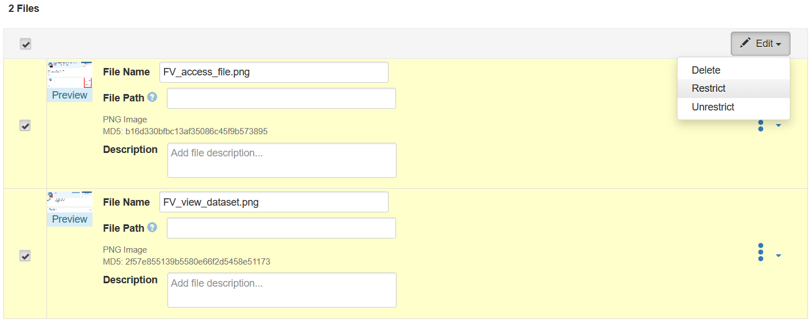

# Red data tag: legally risky or highly sensitive data with strict curatorial control

A dataset must be classified with a red data tag when it contains data that poses substantial legal, or public risk if released without unconditional safeguards.  
Files are deposited normally in FAIRVault, but *remain strictly restricted at all times — there are no dataset access-request mechanisms for users to apply through the interface.

Access to datasets classified under the red data tag is always evaluated case-by-case by data curators and curators alone.  
To initiate this process, researchers must directly contact the FAIRVault curators. The FAIRVault curators may then draft specific Data Use or Data Transfer Agreements where required.

## Example FAIRVault dataset
A Digital Humanities researcher archives a set of personal testimonies containing legally risky material, such as statements involving medical malpractice disputes or confessions describing criminal behavior, including severe public-risk cases like child abuse.  
While these files are deposited in FAIRVault for preservation and research integrity, access is explicitly mediated by curators of that specific institution, in concert with their legal teams, and only granted where a bona fide lawful and justified need exists.

## How to classify?

a) Complete the metadata fields in accordance with the FAIRVault decision tree, answering all questions relevant to confidentiality, legal exposure, and societal harm risk.  
b) Fill out the Decision Tree questionnaire and include the response summary — received by email — as an unrestricted documentation file in the dataset deposit for internal verification and review.

- When multiple files contain different sensitive dimensions, curators will assess all of them individually during classification. *E.g., one file may contain health-related liability risks while another carries public-harm legal risks; both must be flagged appropriately.*

If a dataset contains legal or societal release risk that cannot be mitigated by interface access-request workflows, it qualifies for a red data tag.
- On submission for review, data curators will validate the red data-tag classification.

More information: [FAIRVault Decision Tree for sensitivity of research data.](https://fairvault.github.io/user-documentation/docs/datatags/decision-forest/)

## Checklist when depositing
 - [ ] Deposit dataset files in FAIRVault
 - [ ] Ensure **all files are restricted**, with no access-request feature enabled
 - [ ] Provide complete metadata guidance fields
 - [ ] Upload the response summary from the decision tree as documentation (unrestricted unless exceptionally necessary)
 - [ ] Select 'Custom Dataset Terms' in the license dropdown and provide a concise Terms of Use summary for curator review
 - [ ] Submit dataset for curator review

## Actions for the data curator
- [ ] Validate metadata completeness
- [ ] Validate decision tree and Decision Tree summaries
- [ ] Draft or request supplemental agreements if necessary
- [ ] Confirm red data-tag classification
- [ ] Evaluate necessity and legitimacy of curator-mediated access
- [ ] Document lawful grounds for prohibiting unconditional open sharing if required

## Implementing access restriction to data files for datasets with a Red data tag
- After uploading the files, select the dataset files which should be restricted and click 'Edit' on the right hand side
- In the small drop-down, click 'Restrict'

- Uncheck the box that says "allow access requests"
