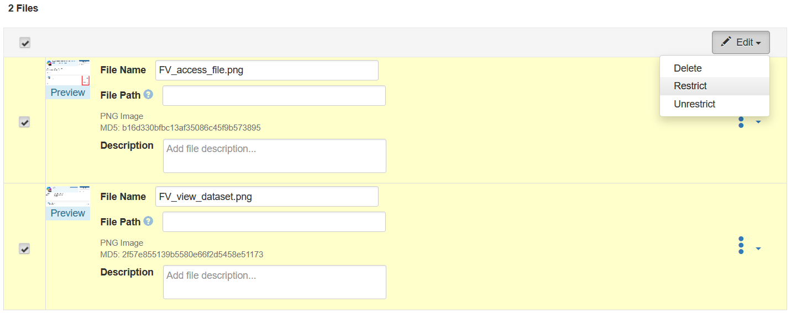

# Red (Metadata only) data tag: highly sensitive or highly confidential data with strict curatorial control

A dataset must be classified with a red (Metadata only) data tag when it contains data that poses substantial legal, or public risk if released without unconditional safeguards.  
By default, only metadata are publicly accessible. Access to data files is restricted and cannot be requested via the FAIRVault interface. Only in exceptional well-justified cases access to data may be granted, under specific conditions, to users who receive explicit authorization.

> Access to datasets classified under the red data tag is always evaluated case-by-case by data curators.  
The FAIRVault curators may then provide specific Data Use or Data Transfer Agreements where required.

## Example FAIRVault dataset
A Digital Humanities researcher archives a set of personal testimonies containing legally risky material, such as statements involving medical malpractice disputes or confessions describing criminal behavior, including severe public-risk cases like child abuse.  
While these files are deposited in FAIRVault for preservation and research integrity, access is explicitly mediated by curators of that specific institution, in concert with their legal teams, and only granted where a bona fide lawful and justified need exists.

## How to classify?

Fill out the the metadata fields relating to the FAIRVault decision tree. This comprises of questions related to the confidentiality of the data.  

- Provide information for the most sensitive data contained in the dataset, for each type of sensitivity. *E.g.: if one file contains personal data and another is important for commercial valorization, both questions should be answered positively.*

If there are high sensitivity or confidentiality risks, the dataset may get a **Red (Metadata only)** data tag.
- When submitting the dataset for review, the data curators will review the data tag classification.

More information: [FAIRVault Decision Tree for sensitivity of research data.](https://fairvault.github.io/user-documentation/docs/datatags/decision-forest/)

## Checklist when depositing
 - [ ] Provide all mandatory and recommended metadata - [link to metadata guidance](../guides/Metadata_overview_v02.pdf)
 - [ ] Include an institutional point of contact: support [at] fairvault.be
 - [ ] Upload the dataset files AND **implement restriction on the dataset files**. Do not allow access requests. 
 - [ ] Edit the Terms: select 'Custom Dataset Terms' in the license dropdown and provide a brief summary of the Terms of Use. The curator will review and further complete the terms during the review process.
 - [ ] Submit the dataset for review

## Actions for the data curator
- [ ] Review metadata
- [ ] Add an institutional point of contact 
- [ ] Review the decision tree responses
- [ ] Review file restriction settings
- [ ] Review terms, add the necessary information
- [ ] Indicate the correct data tag, and if necessary the correct legitimate opt out reason for open sharing

## Implementing access restriction to data files for datasets with a Red data tag
- After uploading the files, select the dataset files which should be restricted and click 'Edit' on the right hand side
- In the small drop-down, click 'Restrict'

- Uncheck the box that says "allow access requests"
