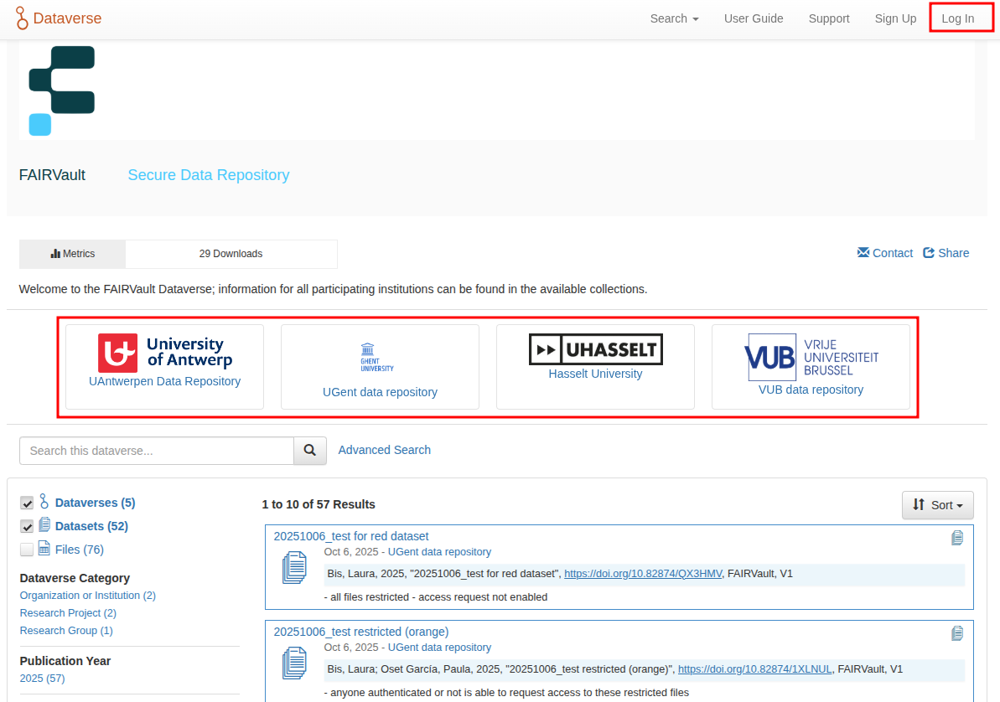
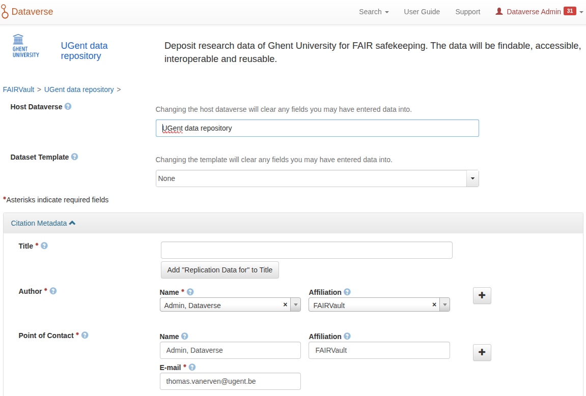
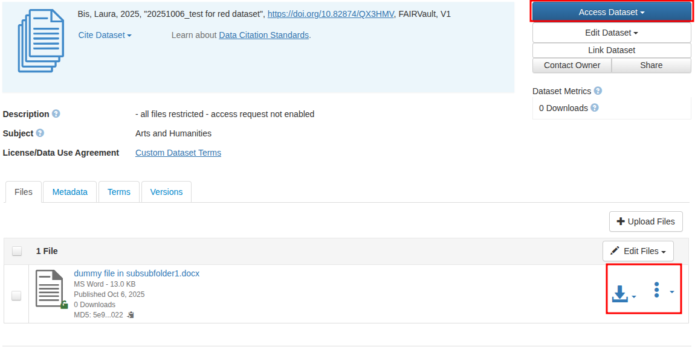
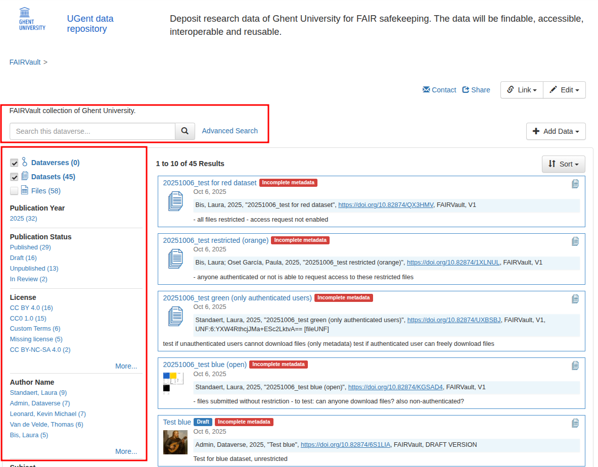

---

title: "Getting Started with FAIRVault"

layout: page

---

# Access

FAIRVault is an instance of Harvard Dataverse, aimed for secure storage of research data. It is presently in pilot status, and hosted at [https://fairvault.dev.ugent.be](https://fairvault.dev.ugent.be). It allows researchers to publish, share, and preserve research data in line with FAIR principles (Findable, Accessible, Interoperable, Reusable).

### Log in with your institutional account

Users of participating institutions can log in using the institutional account through Belnet’s federated access system.

1. Visit the [FAIRVault login page](https://fairvault.dev.ugent.be/loginpage.xhtml).

2. Choose **“Log in via your institution”**.

3. Select your university (UGent, VUB, UHasselt, or UAntwerpen).  

   Using the correct institutional account ensures that you receive the proper permissions automatically.

### ORCID Login (Alternative)

If you are not part of one of the participating institutions, you may use your **ORCID** account to log in.  

After logging in with ORCID, you can request access to certain restricted access datasets.

---

# Usage

### Creating a Dataset

Once logged in:

1. Navigate to the **Dataverse** collection of your institute.
2. Click **“Add Data” → “New Dataset”**.
3. Fill in the metadata fields, such as title, author, contact information, description, keywords, and subject area.
4. Upload your data files.
5. Save the draft and review the metadata before publishing. Curators will review datasets before they are made public.

Creating a dataset looks like this:

### Downloading Datasets and Files

- To download a dataset, open its page and use the **“Download Dataset”** button to retrieve all files as a package.
- To download an individual file, click the **Download** button next to the desired file in the dataset’s file list.
- Some files may have restricted access; in that case, you must request access.

### Searching and Browsing

- Use the search bar at the top of the FAIRVault home page to find datasets by keyword, author, or title.
- You can refine your search using the **filters on the left-hand side** of the results page.  

  These include filters for author, publication date, subject, and file type.
- Each dataset page displays **Facets** (metadata such as author, version, DOI, and publication date) on the left-hand side of the screen.

---

For further assistance, contact the FAIRVault support team via the “Support” link at the bottom of the FAIRVault website.
